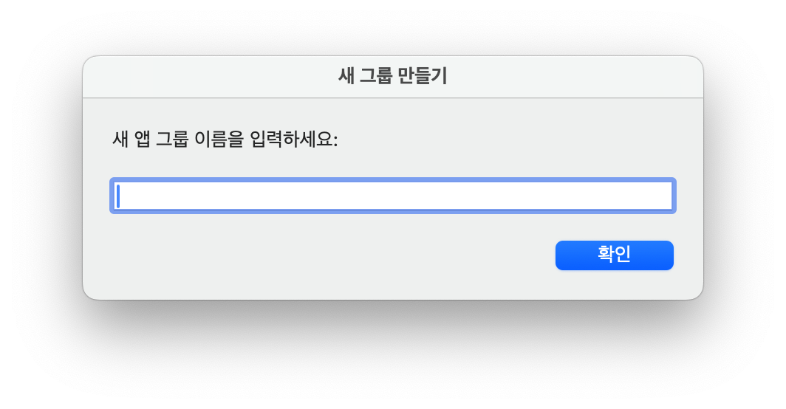
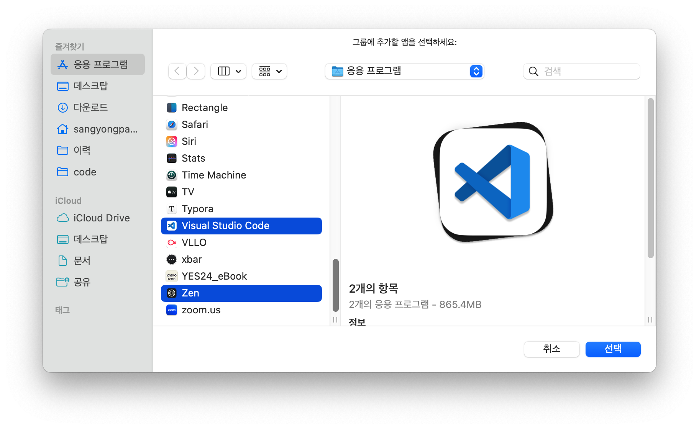
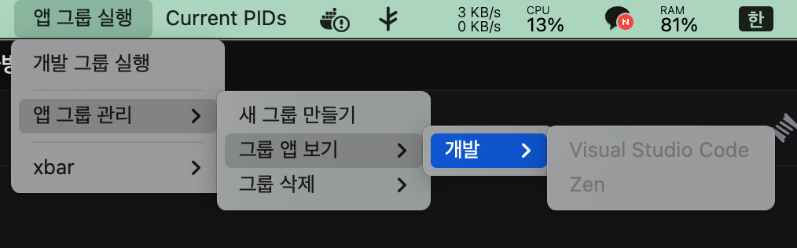

# 앱 그룹 실행 플러그인

## 프로젝트 개요

이 플러그인은 Stream Deck의 여러 앱을 그룹화하여 동시에 실행하는 기능에서 영감을 받아 개발되었습니다. Stream Deck의 해당 기능이 유용하다고 느꼈지만, 필요한 기능 대비 가성비가 떨어진다고 생각하여 직접 구현하게 되었습니다.

## 기능

*   여러 앱을 하나의 그룹으로 묶을 수 있습니다.
*   생성된 그룹을 실행하면 그룹에 포함된 모든 앱이 동시에 실행됩니다.
*   간단하고 직관적인 사용 방법을 제공합니다.

## 사용 방법
1. 새 그룹 만들기

2. 그룹에 속할 앱 선택

## 스크린샷

